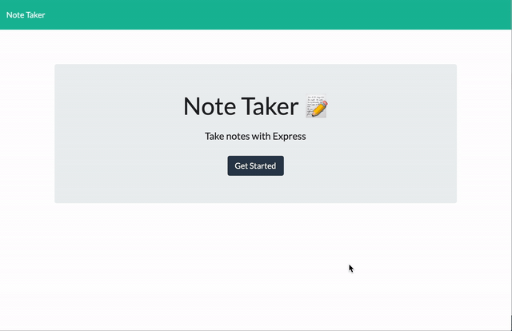

# Express_framework

## Note Taker
[View App Here](https://immense-crag-64718.herokuapp.com/)

## Technology Used

 1. Node.js
 2. Express.js
 3. NPM 
 4. HTML, CSS, Bootstrap
 5. Nodemon
 6. Heroku(Deployment)

## Table of Contents 

* [Installation](#installation)
* [Instruction](#instructions)
* [Author](#author)

## Installation 
> 1. npm init//2. npm install express//3. npm i -g nodemon 

## Instructions
> Open app in your browser. Click on note taker. Once re-directed to the note taker page, press new note icon, and then enter title for note and then text for the note. Click the save  icon and note should be saved and visible on the left-hand side of the browser. You may now enter another note if needed. If saved note needs to be read, click on note title and note text should appear on the center of the browser. To delete a note, click on the delete icon next to the note title that needs to be deleted. 

## Giphy Example:

## Author 
* [Github](https://github.com/musicman785)
